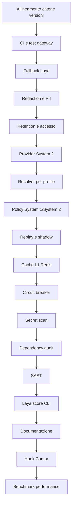

# Work Graph — Multi-Cycle ToDo

- **Source:** file (`ToDo.md`)
- **Goal:** completare in cicli sequenziali i 18 residui attuali, mantenendo gate e acceptance per ogni nodo
- **Auto-accept:** true
- **Multi-cycle:** true
- **Mode:** graph
- **Why mode:** backlog multi-contesto con dipendenze tra provider, decisioni Laya/System 2, eventi e gate CI; esecuzione sequenziale per non sovrapporre i gate.
- **Next:** `node-version-chains` — **BLOCKED**, riallineare le versioni via sync selettivo prima del gate CI

## Nodi

| id | type | owner | input → output | stop / acceptance | next |
|---|---|---|---|---|---|
| `node-version-chains` | act | steward + `/sync` selettivo | version report → catene L1/L2 allineate | nessun `STALE`; `make -C agents test-unit` passa | `node-ci` |
| `node-ci` | act | `/cycle` + steward | ToDo P0 → Make gate + workflow root | test gateway eseguiti; push/PR avviano CI; test rosso fallisce | `node-laya-fallback` |
| `node-laya-fallback` | act | `/cycle` | primitive Laya → esito typed | outage/invalid = fallback/abstain; mai falsa confidence o cache valida | `node-event-redaction` |
| `node-event-redaction` | act | `/cycle` | `gateway_core.py` → event write protetta | secret/PII sintetici non persistiti in chiaro; errore scan incerto | `node-retention` |
| `node-retention` | act | steward + `/cycle` | eventi → lifecycle retention | purge, cifratura e accesso verificati | `node-system2-provider` |
| `node-system2-provider` | act | `/cycle` | `SystemTwoEngine` → backend invocato | risposta reale/mock e modello servito verificabili | `node-model-resolution` |
| `node-model-resolution` | act | `/cycle` | provider → resolver per use-case | capability/profile; default globale; nessuna selezione per agente | `node-s1-s2-policy` |
| `node-s1-s2-policy` | act | `/cycle` | intake + esito Laya → livelli S1/S2 | matrice S1-only / S2 ridotto / S2 completo testata | `node-evals` |
| `node-evals` | act | `/cycle` | routing/modelli → replay + shadow | quality, cost, latency e rollback documentati; gate passa | `node-cache` |
| `node-cache` | act | `/cycle` | cache key → Redis L1 | TTL, hash contenuti, invalidazione e tool boundary testati | `node-breaker` |
| `node-breaker` | act | `/cycle` | provider → breaker integrato | open skip, un solo half-open probe, fallback e recupero testati | `node-secrets` |
| `node-secrets` | act | steward + `/cycle` | CI → secret scanning | fixture segreta rilevata senza leak | `node-deps` |
| `node-deps` | act | steward + `/cycle` | runtime manifest → dependency audit | manifest e advisory test verificati nel gate | `node-sast` |
| `node-sast` | act | steward + `/cycle` | Python gateway → SAST | baseline/waiver espliciti, gate CI verde | `node-score` |
| `node-score` | act | `/cycle` | CLI Laya → score funzionante | test CLI numerico passa | `node-docs` |
| `node-docs` | act | `/cycle` | README/changelog/indice → stato verificabile | claim supportati; indice coerente | `node-hooks` |
| `node-hooks` | act | steward + `/cycle` | riferimenti hook → file verificati | nessun hook richiesto saltato silenziosamente | `node-performance` |
| `node-performance` | act | `/cycle` | batch Laya + gateway hot paths → benchmark | round-trip, tempo e memoria misurati; ottimizzazioni solo se giustificate | `—` |

## Sequenza e gate

Ogni nodo è un ciclo indipendente (≤4 file per slice), con RED → GREEN → REFACTOR → READY. Nessun parallelismo. Dopo ogni gate verde, avanzare al nodo `next`; blocchi di credenziali, decisioni infrastrutturali irreversibili o gate non recuperabili fermano il multi-cycle.

## Progress

- Avvio `-y`: grafo accettato automaticamente.
- `node-version-chains`: **BLOCKED**; prerequisite osservato da `node-ci`: `make -C agents test-unit` fallisce in `version-chains` per L1 (`a-b2b`, `a-copywriter`, `a-design`, `a-harness`, `a-product`, `a-seozoom`, `a-wordpress`) e L2 `harness-agentfactory` STALE.
- Nessun nodo completato; non bypassare il gate né aggiornare in massa le versioni senza sync selettivo.
