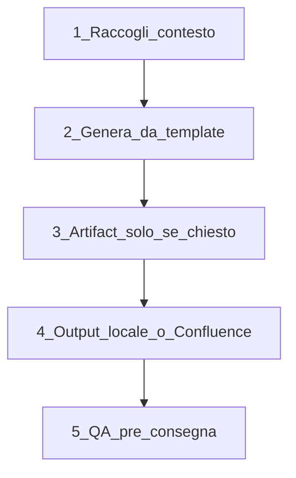

# Analisi dettagliata: `prd-writer.skill`

**Fonte:** [prd-writer.skill](prd-writer.skill) (pacchetto ZIP Claude Skill, ~5.5 KB, data interna 2026-07-30)  
**Adozione AF:** struttura conservata ed evoluta in [`prd-authoring` 1.1.0](../a-product/competencies/prd-authoring/SKILL.md) (a-product) — path vivo, lifecycle `/prd`, KPI/NON-goals/gate Sistema.

---

## Cos’è

`prd-writer.skill` è un **pacchetto Claude Skill** (ZIP), non markdown nativo. Contiene:

| Path nel package | Ruolo |
|---|---|
| `prd-writer/SKILL.md` | Istruzioni operative (quando attivarsi, processo, output, QA) |
| `prd-writer/assets/template_prd.md` | Schema strutturale del PRD da compilare |
| `prd-writer/references/artifact_e_versioni.md` | Sezione opzionale “Artifact e Versioni” (solo su richiesta) |

Nel repo è citata come esempio classico di **skill che produce un PRD** in [Skill VS PRD - Reportistica - Confluence.md](Skill%20VS%20PRD%20-%20Reportistica%20-%20Confluence.md): la skill è la SOP per l’AI; il PRD è l’artefatto per umani.

---

## Frontmatter e trigger

```yaml
name: prd-writer
description: Genera un PRD ... Attiva questa skill ogni volta che l'utente chiede di
  "creare un PRD", "scrivere i requisiti...", ... anche senza la parola "PRD".
  Default: file .md locale. Confluence solo se richiesto. Artifact e Versioni solo
  se richiesto esplicitamente.
```

Punti chiave della `description` (meccanismo di routing di Claude):

- **Trigger ampi**: non solo “PRD”, anche “requisiti”, “user story”, “formalizzare”
- **Default locale**, Confluence opt-in
- **Sezione Artifact opt-in** (evita documenti gonfi)

Anti-trigger esplicito nel body: no brainstorming generico / spec tecniche conversazionali.

---

## Processo operativo (5 fasi)



### 1. Intake minimo (5 punti)

1. Nome prodotto/feature + problema
2. Chi lo usa e perché
3. Ambito (nuovo / feature / update PRD)
4. US già note in chat (estrai, non ri-chiedere)
5. Destinazione (locale default vs Confluence)

Regole UX: **una domanda alla volta**; riusa contesto già detto.

### 2. Generazione documento

Sezioni **obbligatorie** (allineate al template):

1. Header (Prodotto, Versione doc, Data, PO, Stakeholder, Status Draft)
2. Contesto e Vision (Problema, Vision, Utenti target)
3. Epic Map (obiettivo + **US collegate** bidirezionali)
4. User Story US-XX (Epic esplicita + Come/voglio/per + AC checklist)
5. Definition of Done
6. Backlog aperto (priorità Alta/Media/Bassa)
7. Domande aperte (owner + stato)
8. Glossario (solo termini usati)

**Formattazione hard-break** molto specifica: `Epic` / `Come` / `voglio` / `per` ciascuno a inizio riga, con **due spazi finali** sulle prime tre righe per forzare line break Markdown. Dettaglio tipico Claude/Confluence, fragile ma intenzionale.

Versioning documento: parte da **v1.0**, revisioni → minor (1.1, 1.2…).

### 3. Artifact e Versioni (opt-in)

Da `references/artifact_e_versioni.md`:

- 8.1 Artifact attivo (solo latest)
- 8.2 Storico versioni artifact (append-only)
- 8.3 Storico versioni del PRD
- SemVer semplificato: Major = nuova Epic / cambio architetturale; Minor = nuove US; Patch = tipicamente solo artifact dati

Nota Claude-specific: link `claude.ai/artifacts/...` — chiedere UUID, non inventare.

### 4. Output

| Canale | Comportamento |
|---|---|
| **Default** | `PRD_<slug>_v<ver>.md` in `/mnt/user-data/outputs/` + `present_files` |
| **Confluence** | Tool search Atlassian → conferma utente → markdown→HTML → create/update con `pageId` |

Path e tool (`present_files`, `tool_search`, `search_mcp_registry`, `suggest_connectors`) sono **runtime Claude Projects / Cowork**, non Cursor/HAL.

### 5. QA pre-consegna

- ≥1 AC verificabile per US
- Bidirezionalità Epic ↔ US (niente orfani)
- Niente placeholder su campi già forniti
- Glossario = solo termini usati

---

## Schema del template (struttura prodotto)

Il template è un PRD “classico agile light”:

- **Vision** narrativa (Problema + Vision 2–3 frasi)
- **Personas** minimali (Persona → Ruolo d’uso), senza evidence/hypothesis
- **Epic Map** con colonna US collegate (vincolo di coerenza forte)
- **US** con formula “Come / voglio / **per**” (non “così da”)
- **AC** come checklist `- [ ]`
- **DoD** a livello prodotto/feature (non chiaramente distinto come contratto team globale vs AC)
- **Backlog aperto** come sezione di primo livello (cose note non pianificate)
- **OQ** senza campo scadenza
- **Glossario** obbligatorio
- **Niente KPI**, niente NON-goals dedicati, niente status per-US (todo/doing/done)

---

## Punti di forza

1. **Trigger e description** ben scritti per auto-attivazione Claude
2. **Intake lean** + riuso conversazione (poca frizione)
3. **Integrità Epic↔US** come regola di qualità (evita feature dump disordinato)
4. **Artifact opt-in** — buona disciplina anti-bloat
5. **Confluence come canale secondario** con conferma umana (sicurezza collaborativa)
6. **Esempio pedagogico** della distinzione Skill vs PRD nel documento Reportistica

---

## Limiti e gap (rispetto a un PRD “vivo” / AF)

| Area | In `prd-writer` | Assente o debole |
|---|---|---|
| Ciclo di vita | Draft + version bump | Nessun `draft` / `refine` / `live-check` |
| Path canone | File dump one-shot | Nessun living doc tipo `.cursor/product/prd.md` |
| Discovery | Chiede “chi lo userà” | No handoff personas/jtbd; rischio invenzione |
| Scope | — | NON-goals non strutturali |
| Metriche | — | Nessuna sezione KPI |
| Sistema/backend | — | Nessun gate “persona Sistema” vs Technical Spec |
| AC vs DoD | Entrambi presenti | DoD spesso confuso con “feature completa”, non contratto team |
| OQ | Owner + Stato | Manca scadenza |
| Anti-invention | Implicito (estrai da chat) | Non esplicitato come regola ferrea |
| Skill vs PRD | La skill *è* l’esempio | Non guida il PO su “quando estrarre skill dalle US” |
| Sizing | — | Nessuna guida pagine/US per scala |

Output path Claude (`/mnt/user-data/outputs/`) e tool Atlassian **non sono portabili** così com’è in agents/Cursor.

---

## Confronto con `a-po` / `prd-authoring`

La competenza parallela è [`prd-authoring/SKILL.md`](../a-product/competencies/prd-authoring/SKILL.md) + [`prd-template.md`](../a-product/competencies/prd-authoring/references/prd-template.md).

| Dimensione | Claude `prd-writer` | AF `prd-authoring` |
|---|---|---|
| Ruolo | Skill standalone (SOP AI) | Competenza L1 di `a-po` |
| Attivazione | Description NLP | Slash `/prd` (`draft`\|`refine`\|`live-check`) |
| Formula US | Come / voglio / **per** | Come / voglio / **così da** |
| Path output | `PRD_*_vX.md` + Confluence | `.cursor/product/prd.md` (vivo) |
| Artifact | Opt-in, storico SemVer ricco | Tabella semplice sempre nel template |
| KPI / NON-goals / gate Sistema | No | Sì |
| Backlog aperto | Sezione dedicata | Implicito in OQ / status US / prioritize |
| Ecosystem | Claude + Atlassian | Handoff `a-personas`, `a-jtbd`, `a-gherkin`, `/prioritize` |
| Anti-pattern | Pochi | Mammoth stories, AC vaghi, completeness theater, PRD morto |

In sintesi: **`prd-writer` è un generatore di documento strutturato one-shot (con publishing)**; **`prd-authoring` è un workflow di product ownership continuo** nel sistema HAL.

---

## Verdetto

`prd-writer` è una skill **chiara, operativa e ben scoped** per produrre PRD Markdown coerenti (Epic Map ↔ US, AC, DoD, backlog, OQ, glossario), con due opt-in sensati (Artifact, Confluence). È l’istanza concreta della tesi “skill = come; PRD = cosa”.

Non è (e non pretende di essere) un processo di discovery/prioritization: manca ciclicità living-doc, KPI, NON-goals, gate tecnico, e integrazione multi-agente. Per AF, la logica utile è già in gran parte **assorbita e estesa** in `prd-authoring`; il package Claude resta utile come **fonte pedagogica / baseline di schema** e come riferimento per eventuali gap residue (es. sezione “Backlog aperto”, formattazione hard-break, publishing Confluence se mai servisse).
